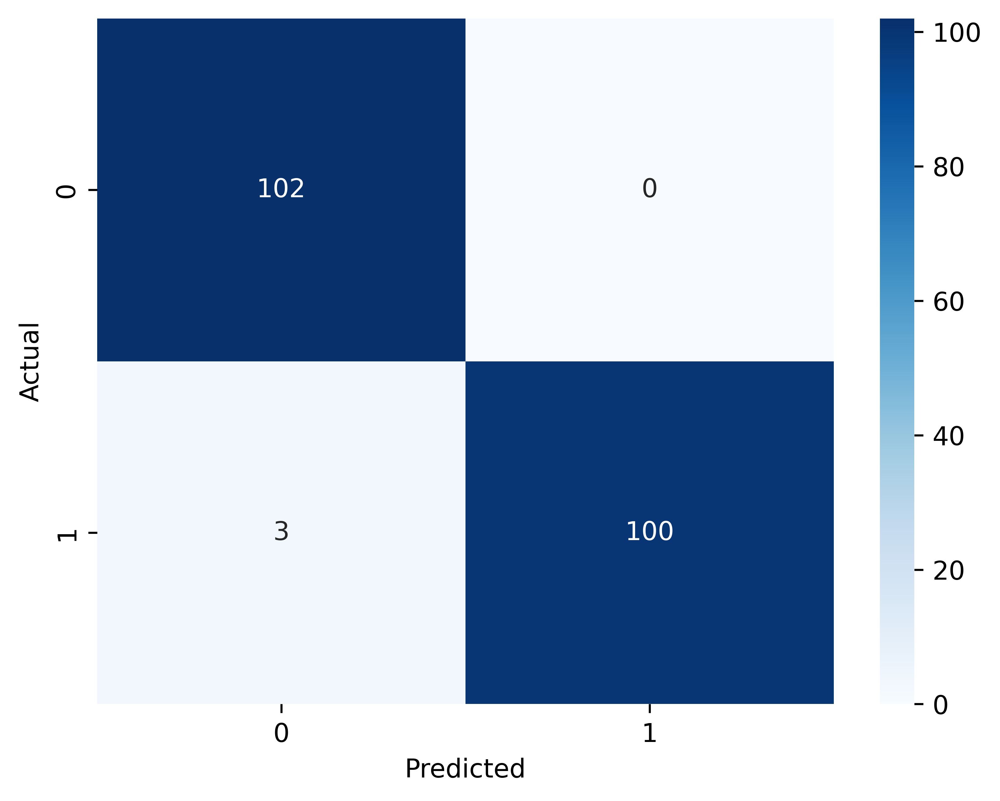

# Heart Disease Prediction — Decision Tree & Random Forest

##  Overview
This project is part of an AI & ML internship task to explore tree-based models for classification.  
Using the **Heart Disease Dataset**, we train and evaluate **Decision Trees** and **Random Forests** to predict the presence of heart disease.

---

##  Dataset
- **Source**: [Heart Disease Dataset on Kaggle](https://www.kaggle.com/datasets/johnsmith88/heart-disease-dataset)
- **Rows**: 1025  
- **Columns**: 14 (13 features + 1 target)
- **Target Variable**: `target` (0 = No disease, 1 = Disease)
- **Class Balance**: Well balanced

---

##  Steps Performed
1. **Data Loading & Exploration**
   - Checked shape, column info, missing values, and class distribution.
   - No missing values found; dataset is balanced.

2. **Data Splitting**
   - 80% training set, 20% testing set.

3. **Model Training**
   - **Decision Tree (full depth)** — Very high accuracy.
   - **Decision Tree (max depth=4)** — Reduced accuracy to avoid overfitting.
   - **Random Forest** — Matched deep Decision Tree accuracy, more robust.

4. **Evaluation Metrics**
   - Accuracy
   - Classification Report
   - Confusion Matrix

5. **Overfitting Analysis**
   - Compared full vs limited tree depth.

6. **Feature Importance**
   - Calculated and plotted for both Decision Tree and Random Forest.

7. **Cross-Validation**
   - 5-fold cross-validation for better generalization assessment.

---

##  Results

| Model | Accuracy |
|-------|----------|
| Decision Tree (full depth) | 98.54% |
| Decision Tree (max depth=4) | 80.00% |
| Random Forest | 98.54% |

- **Feature Importance Example** (Random Forest):
  - `cp`, `thalach`, and `oldpeak` ranked among top predictors.

---

##Tools & Libraries
- Python 3
- Pandas, NumPy
- Matplotlib, Seaborn
- Scikit-learn

---

##  Sample Output

**Confusion Matrix:**

**Feature Importance:**
.png)

.png)
---

## 📌 Conclusion
Tree-based models perform exceptionally well on this dataset.  
While a deep Decision Tree achieves high accuracy, **Random Forest** provides a more generalizable and robust solution.

